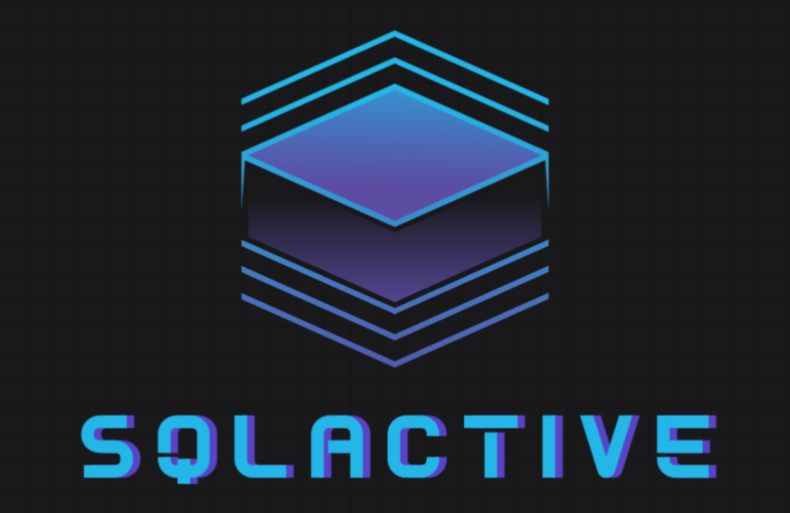

<p align="center">
    
</p>

<p align="center">
    <a href="https://pypi.org/project/sqlactive" target="_blank">
        
    </a>
    <a href="https://pypi.org/project/sqlactive" target="_blank">
        
    </a>
    <a href="https://pypi.org/project/SQLAlchemy" target="_blank">
        
    </a>
    <a href="https://github.com/daireto/sqlactive/actions" target="_blank">
        
    </a>
    <a href='https://coveralls.io/github/daireto/sqlactive?branch=main'>
        
    </a>
    <a href="/LICENSE" target="_blank">
        
    </a>
</p>

# Overview

[SQLActive](https://github.com/daireto/sqlactive) is a lightweight
and asynchronous ActiveRecord-style wrapper for SQLAlchemy.
Bring Django-like queries, automatic timestamps, nested eager loading,
and serialization/deserialization for SQLAlchemy models.

Heavily inspired by
[sqlalchemy-mixins](https://github.com/absent1706/sqlalchemy-mixins).

The source code for this project is available on
[GitHub](https://github.com/daireto/sqlactive).

## Features

- **Asynchronous Support**: Async operations for better scalability.
- **ActiveRecord-like methods**: Perform CRUD operations with a syntax similar
  to [Peewee](https://docs.peewee-orm.com/en/latest/).
- **Django-like queries**: Perform intuitive and
  [expressive queries](https://docs.djangoproject.com/en/1.10/topics/db/queries/#lookups-that-span-relationships).
- **Nested eager loading**: Load nested relationships efficiently.
- **Automatic timestamps**: Auto-manage `created_at` and `updated_at` fields.
- **Serialization/deserialization**: Serialize and deserialize models to/from
  dict or JSON easily.

## Requirements

- Python 3.10+
- sqlalchemy 2.0+

## Installation

You can simply install sqlactive from
[PyPI](https://pypi.org/project/sqlactive/):

```bash
pip install sqlactive
```

## Example

```python
import asyncio

from sqlalchemy import String, ForeignKey
from sqlalchemy.orm import Mapped, mapped_column, relationship
from sqlactive import ActiveRecordBaseModel, DBConnection


# Define a base class for your models (recommended)
class BaseModel(ActiveRecordBaseModel):
    __abstract__ = True


# Define the models
class User(BaseModel):
    __tablename__ = 'users'

    id: Mapped[int] = mapped_column(primary_key=True, autoincrement=True, index=True)
    username: Mapped[str] = mapped_column(String(18), nullable=False, unique=True)
    name: Mapped[str] = mapped_column(String(50), nullable=False)
    age: Mapped[int] = mapped_column(nullable=False)
    posts: Mapped[list['Post']] = relationship(back_populates='user')


class Post(BaseModel):
    __tablename__ = 'posts'

    id: Mapped[int] = mapped_column(primary_key=True, autoincrement=True, index=True)
    title: Mapped[str] = mapped_column(String(100), nullable=False)
    body: Mapped[str] = mapped_column(nullable=False)
    rating: Mapped[int] = mapped_column(nullable=False)
    user_id: Mapped[int] = mapped_column(ForeignKey('users.id'))
    user: Mapped['User'] = relationship(back_populates='posts')


# Create a database connection instance
DATABASE_URL = 'sqlite+aiosqlite://'
conn = DBConnection(DATABASE_URL, echo=False)

async def example():
    # Initialize SQLActive with the base model of your models
    await conn.init_db(BaseModel)

    # Create a record
    user = await User.insert(username='John1234', name='John Doe', age=25)
    post = Post(title='My post', body='Lorem ipsum...', rating=2, user=user)
    await post.save()

    # Retrieve a record
    user = await User.get(1)

    # Update a record
    await user.update(name='John Doe', age=30)
    post.rating = 3
    await post.save()

    # Delete a record
    await user.delete()

    # Find records
    users = await User.where(User.name == 'John Doe').all()  # SQLAlchemy-like query
    posts = await Post.where(title__contains='post').all()   # Django-like query

    # Serialize a record
    user_dict = user.to_dict()
    user_json = user.to_json()

    # Deserialize a record
    user = User.from_dict(user_dict)
    user = User.from_json(user_json)


if __name__ == '__main__':
    asyncio.run(example())
```

## Contributing

Please read the [contribution guidelines](about/contributing.md).

## License

This project is licensed under the terms of the [MIT License](about/license.md).
